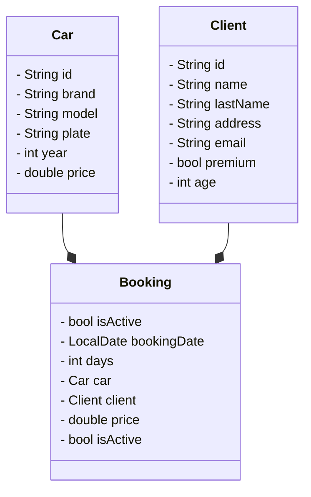

# rentingCar v1

`version document: v1.2`


## Goal & Summary

> Rent a car by CLI with client, car, init and ending date, price


- Reference project: [GitHub - AlbertProfe/restaurant](https://github.com/AlbertProfe/restaurant)

 

## Version

| Version | Title                   | Description                                  | Status         |
| ------- | ----------------------- | -------------------------------------------- | -------------- |
| v1.0    | Create project and test | Basic test to create cars: testCar();        | 22/9 - da0e3f1 |
| v1.1    | Test booking            | Basic test to create booking: testBooking(); | 22/9 - da0e3f1 |
| v1.2    | Fake cars and list cars | Create HashMap or List to store fake cars    |                |
| v1.3    | Main Loop & Scanner     | Create main loop to select options           |                |
| v1.4    | Fake client             | Create HashMap or List to store fake clients |                |


## UML Data Model

### CLASS Car

```java
ackage org.example;

public class Car {
    private String id;
    private String brand;
    private String model;
    private String plate;
    private int year;
    private double price;
    

    // constructor, geters, setters, methods and toString

    private int carAge ()


}
```

### CLASS Client

```java
public class Client {

    private String id;
    private String name;
    private String lastName;
    private String address;
    private String email;
    private boolean premium;
    private int age;

    // constructor, geters, setters, methods and toString
}
```

#### CLASS Booking

```java
public class Booking {

    private String id;
    //private Client client;
    private Car car;
    private int days;
    private double price;
    private boolean isActive;
    // private LocalDate bookingDate

    // constructor, geters, setters, methods and toString
}
```

## Syntetic data & fake objects

- [GitHub - DiUS/java-faker: Brings the popular ruby faker gem to Java](https://github.com/DiUS/java-faker)

> This library is a port of Ruby's [faker](https://github.com/stympy/faker) gem (as well as Perl's Data::Faker library) that generates fake data. It's useful when you're developing a new project and need some pretty data for showcase.


Usage

In pom.xml, add the following xml stanza between `<dependencies> ... </dependencies>`

```xml
<dependency>
    <groupId>com.github.javafaker</groupId>
    <artifactId>javafaker</artifactId>
    <version>1.0.2</version>
</dependency>
```

Code example:

```java
Faker faker = new Faker();

String name = faker.name().fullName(); // Miss Samanta Schmidt
String firstName = faker.name().firstName(); // Emory
String lastName = faker.name().lastName(); // Barton

String streetAddress = faker.address().streetAddress(); // 60018 Sawayn Brooks Suite 449
```


## UML




## CLI UI

```shell
Starting code...


Chose an option (0 to quit):
0. Quit
1. Tests
2. List Cars
3. Login Client
4. Make a booking


Option?
```


## Tech Stack

- IDE: IntelliJ IDEA 2025.1.3 (Community Edition)
  
  - [Descargar IntelliJ IDEA](https://www.jetbrains.com/es-es/idea/download/?section=linux)
  
  - With [Installing snap on Ubuntu | Snapcraft documentation](https://snapcraft.io/docs/installing-snap-on-ubuntu): `sudo snap install intellij-idea-community --classic`

- Java 21 (or 25, 17, 11, 8)

- JUniit 3.8.1

- Maven Project: **`maven-archetype-quickstart` archetype**
  
  - https://maven.apache.org/
  
  - mvn --version
    Apache Maven 3.8.7
    Maven home: /usr/share/maven
    Java version: 21.0.8, vendor: Ubuntu, runtime: /usr/lib/jvm/java-21-openjdk-amd64
    Default locale: en_US, platform encoding: UTF-8
    OS name: "linux", version: "6.8.0-83-generic", arch: "amd64", family: "unix"

## POM.XML

```xml
<project xmlns="http://maven.apache.org/POM/4.0.0" xmlns:xsi="http://www.w3.org/2001/XMLSchema-instance"
  xsi:schemaLocation="http://maven.apache.org/POM/4.0.0 http://maven.apache.org/xsd/maven-4.0.0.xsd">
  <modelVersion>4.0.0</modelVersion>

  <groupId>org.example</groupId>
  <artifactId>rentingCarTest</artifactId>
  <version>1.0-SNAPSHOT</version>
  <packaging>jar</packaging>

  <name>rentingCarTest</name>
  <url>http://maven.apache.org</url>

  <properties>
    <project.build.sourceEncoding>UTF-8</project.build.sourceEncoding>
  </properties>

  <dependencies>
    <dependency>
      <groupId>junit</groupId>
      <artifactId>junit</artifactId>
      <version>3.8.1</version>
      <scope>test</scope>
    </dependency>
  </dependencies>
</project>
```

## 
