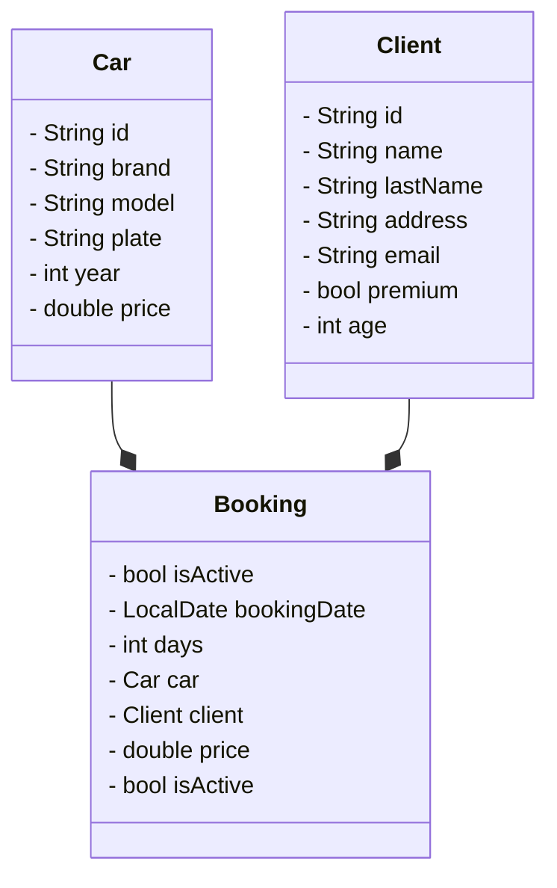

# rentingCar v2

`version document: v2.0`

## Goal & Summary

> Rent a car by CLI with client, car, init and ending date, price with Spring Boot

- Reference project: [Spring Boot: H2 DB and Thymeleaf – albertprofe wiki](https://albertprofe.dev/springboot/boot-what-create-th-h2.html)
- Microservices: https://spring.io/
- Spring Boot is open-source: [GitHub - spring-projects/spring-boot: Spring Boot helps you to create Spring-powered, production-grade applications and services with absolute minimum fuss.](https://github.com/spring-projects/spring-boot)
- Quickstart: https://spring.io/quickstart

## Version

- [rentingCarTest/docs/rentingCar-sprints.md at master · AlbertProfe/rentingCarTest · GitHub](https://github.com/AlbertProfe/rentingCarTest/blob/master/docs/rentingCar-sprints.md)

## Tree

```
├── HELP.md
├── mvnw
├── mvnw.cmd
├── pom.xml
├── src
│   ├── main
│   │   ├── java
│   │   │   └── dev
│   │   │       └── app
│   │   │           └── rentingCar_boot
│   │   │               └── RentingCarBootApplication.java
│   │   └── resources
│   │       ├── application.properties
│   │       ├── static
│   │       └── templates
│   └── test
│       └── java
│           └── dev
│               └── app
│                   └── rentingCar_boot
│                       └── RentingCarBootApplicationTests.java
└── target
    ├── classes
    │   ├── application.properties
    │   └── dev
    │       └── app
    │           └── rentingCar_boot
    │               └── RentingCarBootApplication.class
    └── generated-sources
        └── annotations
```

## UML Data Model

#### CLASS Car

```java
ackage org.example;

public class Car {
    private String id;
    private String brand;
    private String model;
    private String plate;
    private int year;
    private double price;

    // constructor, geters, setters, methods and toString

    private int carAge ()
}
```

#### CLASS Client & MinimalClient

```java
public class Client {

    private String id;
    private String name;
    private String lastName;
    private String address;
    private String email;
    private boolean premium;
    private int age;
    private String password;

    // constructor, geters, setters, methods and toString
}


public class MinimalClient {

    private String email;
    private String password;

    public MinimalClient() {
    }

    // constructor, geters, setters, methods and toString
}
```

#### CLASS Booking

```java
public class Booking {

    private String id;
    //private Client client;
    private Car car;
    private int days;
    private double price;
    private boolean isActive;
    // private LocalDate bookingDate

    // constructor, geters, setters, methods and toString
}
```

## H2

> Welcome to H2, the Java SQL database. The main features of H2 are:
> 
> - Very fast, open source, JDBC API
> - Embedded and server modes; in-memory databases
> - Browser based Console application
> - Small footprint: around 2.5 MB jar file size

- https://h2database.com/html/installation.html

#### Config application.properties

```properties
spring.application.name=rentingCar-boot


#spring.datasource.url=jdbc:h2:tcp://localhost/~/MyProjects/Sandbox/rentingCarTest/dataBase/rentingCar.db
spring.datasource.url=jdbc:h2:/home/albert/MyProjects/Sandbox/rentingCarTest/dataBase/rentingCar
#spring.datasource.url=jdbc:h2:mem:testdb
spring.datasource.driverClassName=org.h2.Driver
spring.datasource.username=albert
#spring.datasource.username=sa
spring.datasource.password=1234
#spring.datasource.password=

spring.jpa.database-platform=org.hibernate.dialect.H2Dialect
spring.jpa.show-sql=true
#spring.jpa.hibernate.ddl-auto=create
spring.jpa.hibernate.ddl-auto=update
```

## Syntetic data & fake objects

- [GitHub - DiUS/java-faker: Brings the popular ruby faker gem to Java](https://github.com/DiUS/java-faker)

> This library is a port of Ruby's [faker](https://github.com/stympy/faker) gem (as well as Perl's Data::Faker library) that generates fake data. It's useful when you're developing a new project and need some pretty data for showcase.

Usage

In pom.xml, add the following xml stanza between `<dependencies> ... </dependencies>`

```xml
<dependency>
    <groupId>com.github.javafaker</groupId>
    <artifactId>javafaker</artifactId>
    <version>1.0.2</version>
</dependency>
```

Code example:

```java
Faker faker = new Faker();

String name = faker.name().fullName(); // Miss Samanta Schmidt
String firstName = faker.name().firstName(); // Emory
String lastName = faker.name().lastName(); // Barton

String streetAddress = faker.address().streetAddress(); // 60018 Sawayn Brooks Suite 449
```

## UML Renting Car



## Tech Stack

- IDE: IntelliJ IDEA 2025.1.3 (Community Edition)
  
  - [Descargar IntelliJ IDEA](https://www.jetbrains.com/es-es/idea/download/?section=linux)
  
  - With [Installing snap on Ubuntu | Snapcraft documentation](https://snapcraft.io/docs/installing-snap-on-ubuntu): `sudo snap install intellij-idea-community --classic`

- Java 21 (or 25, 17, 11, 8)

- JUniit 3.8.1

- Maven Project from https://start.spring.io/
  
  - Dependencies: Spring Web, H2, DevTools, Thymeleaf, JPA

## POM.XML

```xml
<project xmlns="http://maven.apache.org/POM/4.0.0" xmlns:xsi="http://www.w3.org/2001/XMLSchema-instance"
  xsi:schemaLocation="http://maven.apache.org/POM/4.0.0 http://maven.apache.org/xsd/maven-4.0.0.xsd">
  <modelVersion>4.0.0</modelVersion>

  <groupId>org.example</groupId>
  <artifactId>rentingCarTest</artifactId>
  <version>1.0-SNAPSHOT</version>
  <packaging>jar</packaging>

  <name>rentingCarTest</name>
  <url>http://maven.apache.org</url>

  <properties>
    <project.build.sourceEncoding>UTF-8</project.build.sourceEncoding>
  </properties>
  <dependencies>
    <!-- JUnit: tool to test  -->
    <dependency>
      <groupId>junit</groupId>
      <artifactId>junit</artifactId>
      <version>3.8.1</version>
      <scope>test</scope>
    </dependency>

    <!-- Java Faker: fake data creation -->
    <dependency>
      <groupId>com.github.javafaker</groupId>
      <artifactId>javafaker</artifactId>
      <version>1.0.2</version>
    </dependency>

  </dependencies>
</project>
```
